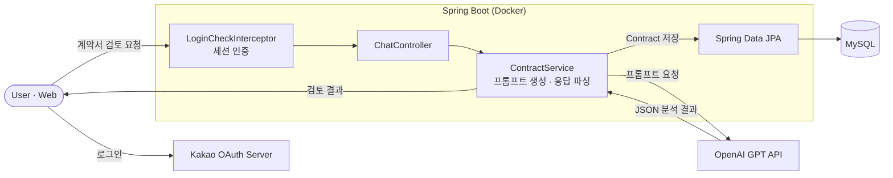
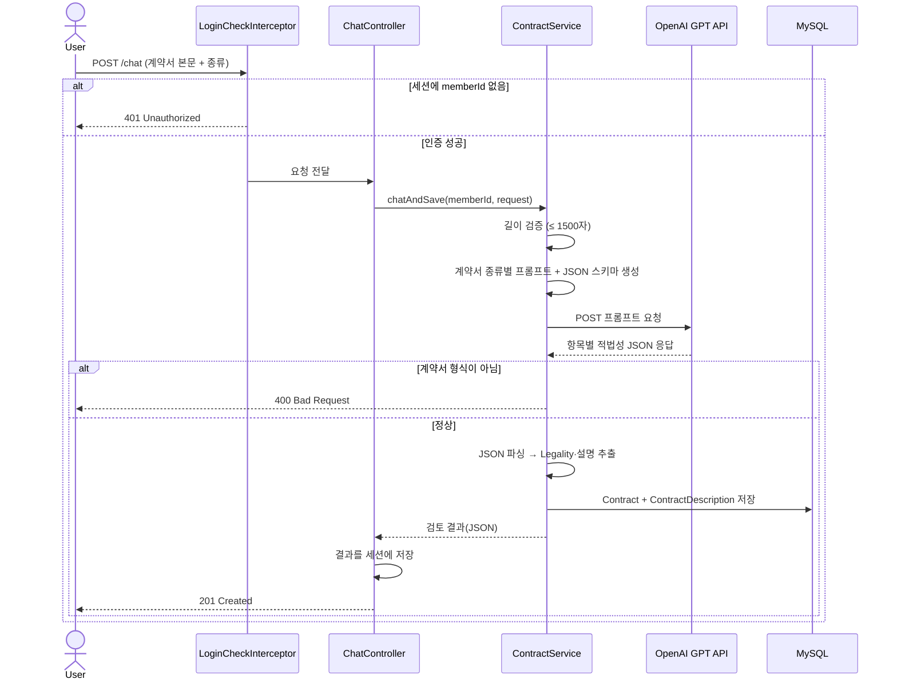
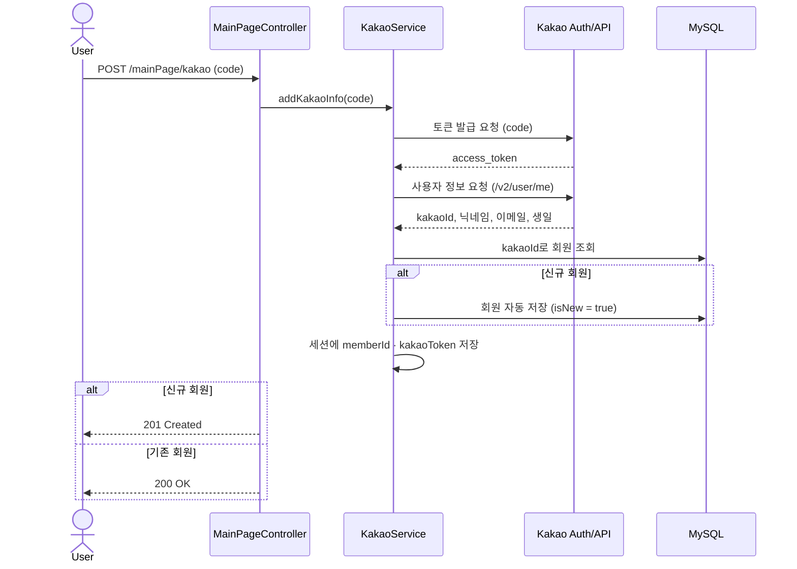
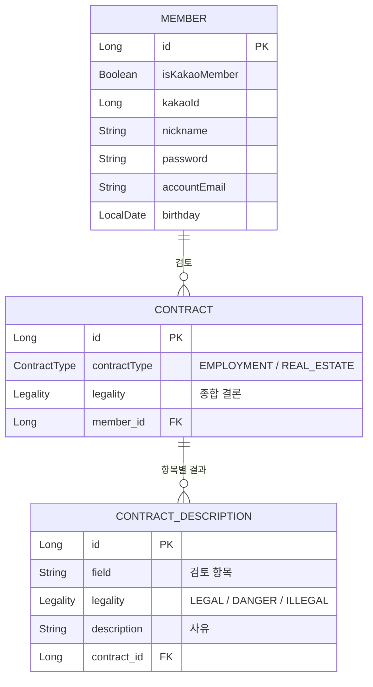

# 계약서 검토 서비스 (FireFox) — Backend

> AI(GPT)를 활용한 **근로/부동산 계약서 적법성 검토** 서비스의 백엔드 서버
> 사용자가 계약서 내용을 입력하면, 항목별로 합법·의심·위법 여부를 분석해 그 이유와 함께 돌려줍니다.

멋쟁이사자처럼(LikeLion) 해커톤 **FireFox** 팀 프로젝트입니다.

> ⚠️ AWS(EC2) 배포는 진행했었으나 운영 서버는 약 2년 전 종료되어 현재 동작하지 않습니다.
> 이 저장소는 당시 작성한 백엔드 소스 코드 기록입니다.

---

## 목차

- [기술 스택](#기술-스택)
- [동작 흐름](#동작-흐름)
- [계약서 검토 시퀀스](#계약서-검토-시퀀스)
- [카카오 로그인 시퀀스](#카카오-로그인-시퀀스)
- [도메인 모델](#도메인-모델)
- [주요 기능](#주요-기능)
- [패키지 구조](#패키지-구조)
- [API 개요](#api-개요)
- [로컬 실행](#로컬-실행)

---

## 기술 스택

| 구분 | 사용 기술 |
|------|-----------|
| **Language / Runtime** | Java 17 (OpenJDK) |
| **Framework** | Spring Boot 3.3.1, Spring MVC |
| **Persistence** | Spring Data JPA, MySQL |
| **Auth** | 세션 기반 인증(HandlerInterceptor), Kakao OAuth2 로그인 |
| **AI** | OpenAI GPT API 연동 (RestTemplate) |
| **API 문서** | springdoc-openapi (Swagger UI) |
| **기타** | Lombok, json-simple, Bean Validation |
| **Infra** | Docker, Docker Compose (Spring Boot + MySQL 컨테이너) |

> `spring-boot-starter-webflux`, `thymeleaf` 의존성이 포함되어 있으나 핵심 로직은 Spring MVC + `@RestController` 기반입니다.

---

## 동작 흐름

계약서 텍스트를 GPT 프롬프트로 가공해 OpenAI에 전달하고, 정해진 JSON 스키마로 응답을 받아
항목별 적법성을 파싱·저장한 뒤 클라이언트에 반환합니다.



1. 사용자가 계약서 종류(근로/부동산)와 본문을 입력 (최대 약 1,500자)
2. `ContractService`가 계약서 종류에 맞는 프롬프트와 **고정 JSON 응답 스키마**를 구성
3. OpenAI 응답을 파싱해 항목별 `Legality`(LEGAL / DANGER / ILLEGAL)와 설명을 추출
4. 계약서가 형식에 맞지 않으면 `BAD_REQUEST`로 안내, 정상이면 결과를 DB에 저장 후 반환

---

## 계약서 검토 시퀀스

`POST /chat` 요청이 처리되는 전체 과정입니다. 인증 → 프롬프트 생성 → GPT 호출 → 파싱·저장 → 결과 반환 순으로 진행됩니다.



---

## 카카오 로그인 시퀀스

`POST /mainPage/kakao`로 전달된 인가 코드(`code`)를 사용해 카카오 토큰·사용자 정보를 받아오고,
신규 사용자는 자동 가입한 뒤 세션을 생성합니다.



---

## 도메인 모델

회원(`Member`)은 여러 계약서(`Contract`)를 가지며, 각 계약서는 항목별 검토 결과(`ContractDescription`)를 갖습니다.



---

## 주요 기능

### 계약서 검토 (`contract`)

- **근로 계약서**: 임금, 소정 근로 시간, 휴일, 연차 유급 휴가, 근무 장소, 담당 업무 항목별 검토
- **부동산 계약서**: 부동산 위치, 거래 대금, 특약 사항, 인적 사항 항목별 검토
- 각 항목을 `합법(legal) / 의심(danger) / 위법(illegal)`로 분류하고 사유를 함께 제공
- 항목별 결과와 종합 결론을 `Contract` + `ContractDescription` 엔티티로 저장

### 회원 / 인증 (`user`)

- **Kakao OAuth2 로그인**: 인가 코드로 토큰 발급 → 카카오 사용자 정보 조회 → 신규 시 자동 가입
- **일반 로그인 / 회원가입**: 이메일·닉네임 중복 체크 포함
- **세션 기반 인증**: `LoginCheckInterceptor`가 보호 경로의 `memberId` 세션을 검증
- **마이페이지**: 본인이 검토한 계약서 목록 페이징 조회
- 로그아웃 (카카오 회원은 카카오 로그아웃 API 연동)

---

## 패키지 구조

```
src/main/java/com/firewolf/cont
├── ContApplication.java
├── contract                 # 계약서 검토 도메인
│   ├── controller           # ChatController
│   ├── service              # ContractService (GPT 연동 · 파싱 · 저장)
│   ├── repository
│   ├── entity               # Contract, ContractDescription, Legality
│   │   └── enumtype         # ContractType, Employment, RealEstate
│   └── dto
│       └── gpt              # GPT 요청/응답 DTO
├── user                     # 회원 · 인증 도메인
│   ├── controller           # LoginPage, MainPage(Kakao), Member
│   ├── service              # MemberService, KakaoService
│   ├── repository
│   ├── entity               # Member
│   └── dto
├── interceptor              # LoginCheckInterceptor (세션 인증)
├── exception                # 전역 예외 처리 + CustomErrorCode
└── global
    ├── config               # WebConfig(CORS·Interceptor), GptConfig, SwaggerConfig
    └── BaseEntity           # JPA Auditing (생성/수정 일시)
```

---

## API 개요

| Method | Path | 설명 | 인증 |
|--------|------|------|:----:|
| `GET`  | `/loginPage` | 카카오 로그인 링크 조회 | - |
| `POST` | `/loginPage` | 일반 로그인 | - |
| `POST` | `/loginPage/save` | 회원가입 | - |
| `GET`  | `/loginPage/save/checkEmail` | 이메일 중복 체크 | - |
| `POST` | `/mainPage/kakao` | 카카오 로그인/회원가입 (`code` 필요) | - |
| `GET`  | `/mainPage` | 메인 페이지(회원 정보) | ✅ |
| `POST` | `/mainPage/logout` | 로그아웃 | ✅ |
| `GET`  | `/member/myPage` | 마이페이지(검토 내역) | ✅ |
| `POST` | `/chat` | 계약서 검토 + 저장 | ✅ |
| `GET`  | `/chat/chatResultPage` | 직전 검토 결과 조회 | ✅ |

> 전체 스펙은 애플리케이션 실행 후 Swagger UI(`/swagger-ui/index.html`)에서 확인할 수 있습니다.

---

## 로컬 실행

### 사전 요구사항

- JDK 17
- MySQL (또는 Docker Compose의 MySQL 컨테이너 사용)
- OpenAI API Key, Kakao OAuth 앱 키

### 설정 파일

`application.yml`, `application.properties`는 `.gitignore` 처리되어 있습니다.
`src/main/resources/`에 아래 키들을 채운 설정 파일을 직접 생성해야 합니다.

```yaml
spring:
  datasource:
    url: jdbc:mysql://localhost:3306/firefox
    username: <user>
    password: <password>

gpt:
  model: <model>          # 예: gpt-3.5-turbo
  api:
    url: https://api.openai.com/v1/chat/completions
    key: <openai-api-key>
    max_tokens: <number>

kakao:
  client_id: <kakao-rest-api-key>
  redirect_uri: <redirect-uri>
```

### 실행

```bash
./gradlew bootRun
# 또는
./gradlew clean build && java -jar build/libs/cont-0.0.1-SNAPSHOT.jar
```

### Docker Compose

Spring Boot 앱과 **MySQL을 함께 컨테이너로** 띄웁니다.

```bash
docker-compose up
```

> `docker-compose.yml`은 MySQL 컨테이너(`mysql:latest`)와 앱 컨테이너를 함께 구성하며,
> `SPRING_JPA_HIBERNATE_DDL_AUTO=create`로 기동 시 스키마를 생성합니다.
